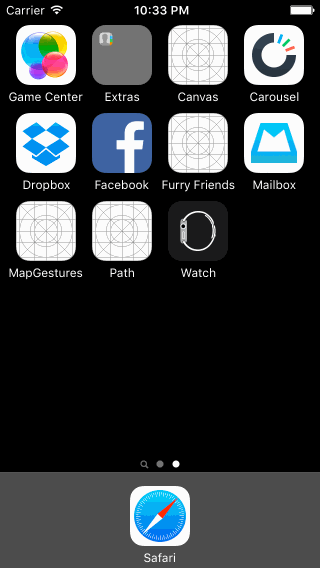

# Mailbox App

This is an iPhone demo application showing select interactions from the [Mailbox iOS App](https://www.mailboxapp.com/). Built using Codepath's [Mailbox  Tutorial](http://courses.codepath.com/courses/ios_for_designers/unit/3#!assignment).

Time spent: 12 hours spent in total

Completed user stories:

 * [x] Required: On dragging the message left...
 * [x] Required: On dragging the message right..
 * [x] Optional: Sign Up
    * [x] Optional: Tapping in the form reveals the keyboard and shifts the scrollview and "Create a Dropbox" button up.
    * [x] Optional: Tapping the Agree to Terms checkbox selects the checkbox.
    * [x] Optional: Tapping on Terms shows a webview with the terms.
    * [x] Optional: User is taken to the tutorial screens upon tapping the "Create a Dropbox" button.
 * [x] Optional: Panning from the edge should reveal the menu
    * [x] Optional: If the menu is being revealed when the user lifts their finger, it should continue revealing.
    * [x] Optional: If the menu is being hidden when the user lifts their finger, it should continue hiding.
 * [x] Optional: Shake to undo.
 

Walkthrough of all user stories:

GIF created with [LiceCap](http://www.cockos.com/licecap/).
